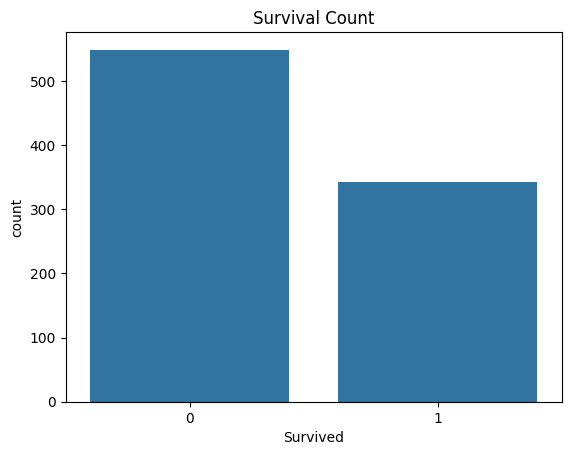
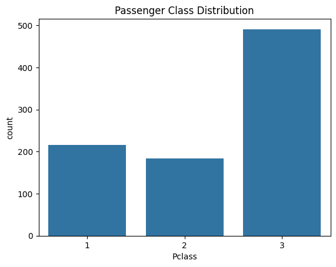

# sainath1218.github.io
Titanic Analysis

1. Problem Space (Clarification of the Problem Space)
What: The goal of this project is to analyze the Titanic dataset to identify factors that influenced passenger survival during the tragic sinking of the ship in 1912.
Why: Understanding these factors provides insights into historical decisions and survival patterns, which can have educational value and relevance for disaster management studies.
Who: This analysis is useful for historians, sociologists, and educators interested in understanding human behavior in disaster scenarios.
Where: The data focuses on passengers aboard the RMS Titanic, a transatlantic ocean liner.
When: The dataset covers the period of the ship's voyage in 1912.

2. Questions to Address through Data Analysis
What was the survival rate of passengers on the Titanic?
How did gender affect survival rates?
Was there a significant difference in survival rates among different passenger classes (Pclass)?
Did the age of passengers influence their chances of survival?
Were passengers who embarked from different ports (Embarked) more or less likely to survive?
What was the correlation between having family members on board (SibSp and Parch) and survival rates?

3. Understanding of Dataset
Data Source: The Titanic dataset is publicly available on Kaggle and contains detailed information about the passengers aboard the RMS Titanic.

Dataset Description: The dataset includes fields such as:
Survived: Survival status (1 = Survived, 0 = Did not survive).
Pclass: Passenger class (1st, 2nd, or 3rd).
Sex: Gender of the passenger.
Age: Age of the passenger.
SibSp and Parch: Number of family members onboard.
Embarked: Port of embarkation (C = Cherbourg, Q = Queenstown, S = Southampton).

Dataset Relevance:
The dataset provides all the necessary variables to analyze factors influencing survival rates, such as gender, age, passenger class, and family relationships.

Questions and Answers
1.	What is the overall survival rate of Titanic passengers?
Answer: Based on the Survived column, the survival rate is approximately 38%, 
2.	How does gender affect the survival rate?
Answer: Grouped analysis shows that female passengers had a significantly higher survival rate than male passengers, indicating a priority for rescuing women during the evacuation. This indicates that the priority of rescue for women is higher than that for men
3.	Is there a significant difference in survival rates across different passenger classes (Pclass)?
Answer: Survival rates are notably higher for passengers in higher classes (especially 1st class). This suggests that passenger class influenced rescue priority. It could be proximity to the lifeboats or social norms. 
4.	Does age influence survival rate?
Answer: Boxplots or age distribution analysis reveal that younger passengers (especially children) had a higher survival rate.
5.	What is the impact of embarkation ports (Embarked) on survival rates?
Answer: Grouped statistics show that passengers who embarked from Cherbourg (C) had the highest survival rate, possibly due to a higher concentration of first-class passengers from this port.
6.	Did traveling with family affect survival rates?
Answer: Grouped analysis based on the combined values of SibSp and Parch indicates that passengers with a moderate number of family members had a higher survival rate, while those traveling alone or with many family members had lower survival rates. Medium-sized families may be better helped during the evacuation process or because family members help each other.

Titanic data analysis summary report

Data background
Titanic data set contains the basic information of passengers and survival labels for analyzing the factors affecting the survival rate.

Key finding

Female passengers have a significantly higher survival rate than male passengers.
The survival rate of first class passengers is significantly higher than that of other classes.

The survival rate for child passengers is better than average.

The port of embarkation (Cherbourg) has the highest survival rate for passengers.

Data support

Charts and data presentations (e.g., survival charts, sex and survival charts, etc.).

Conclusion

The main influencing factors of survival rate include sex, cabin and age. These factors may play an important role in prioritizing rescue decisions in a disaster.

<!DOCTYPE html>

<!DOCTYPE html>
<html xmlns="http://www.w3.org/1999/xhtml" lang="" xml:lang="">
<head>
  <meta charset="utf-8" />
  <meta name="generator" content="pandoc" />
  <meta name="viewport" content="width=device-width, initial-scale=1.0, user-scalable=yes" />
  <title>d280ffd4b0c949f0b2faa707c0171910</title>
  
  <!--[if lt IE 9]>
    
  <![endif]-->
</head>
<body>

import libraries

<pre
class="sourceCode python"><code class="sourceCode python">import pandas as pd
import seaborn as sns
import matplotlib.pyplot as plt</code></pre>

""" Project: Titanic Survival Analysis Author: Shiping Yu, Tianhao
Wang, Bohan Yang, Andrew Xu, Sainath sunkara

Description: This project analyzes the Titanic dataset to identify
key factors influencing passenger survival rates. The dataset includes
demographic information, ticket class, and survival status of the
passengers.

Key Questions to Address:

<ol>
<li>What is the overall survival rate?</li>
<li>How does gender influence survival rates?</li>
<li>What are the survival rates for different passenger classes?</li>
<li>Does age impact the likelihood of survival?</li>
<li>Is there a relationship between the port of embarkation and survival
rate?</li>
<li>Does the number of family members aboard influence survival?
"""</li>
</ol>

<h1 id="step-1-load-the-dataset">Step 1: Load the dataset</h1>

<pre
class="sourceCode python"><code class="sourceCode python">data = pd.read_csv(&#39;titanic.csv&#39;)
print(data.head())
print(data.info())
print(data.describe())
print(data.isnull().sum())</code></pre>

<pre><code>   PassengerId  Survived  Pclass  \
0            1         0       3   
1            2         1       1   
2            3         1       3   
3            4         1       1   
4            5         0       3   

                                                Name     Sex   Age  SibSp  \
0                            Braund, Mr. Owen Harris    male  22.0      1   
1  Cumings, Mrs. John Bradley (Florence Briggs Th...  female  38.0      1   
2                             Heikkinen, Miss. Laina  female  26.0      0   
3       Futrelle, Mrs. Jacques Heath (Lily May Peel)  female  35.0      1   
4                           Allen, Mr. William Henry    male  35.0      0   

   Parch            Ticket     Fare Cabin Embarked  
0      0         A/5 21171   7.2500   NaN        S  
1      0          PC 17599  71.2833   C85        C  
2      0  STON/O2. 3101282   7.9250   NaN        S  
3      0            113803  53.1000  C123        S  
4      0            373450   8.0500   NaN        S  
&lt;class &#39;pandas.core.frame.DataFrame&#39;&gt;
RangeIndex: 891 entries, 0 to 890
Data columns (total 12 columns):
 #   Column       Non-Null Count  Dtype  
---  ------       --------------  -----  
 0   PassengerId  891 non-null    int64  
 1   Survived     891 non-null    int64  
 2   Pclass       891 non-null    int64  
 3   Name         891 non-null    object 
 4   Sex          891 non-null    object 
 5   Age          714 non-null    float64
 6   SibSp        891 non-null    int64  
 7   Parch        891 non-null    int64  
 8   Ticket       891 non-null    object 
 9   Fare         891 non-null    float64
 10  Cabin        204 non-null    object 
 11  Embarked     889 non-null    object 
dtypes: float64(2), int64(5), object(5)
memory usage: 83.7+ KB
None
       PassengerId    Survived      Pclass         Age       SibSp  \
count   891.000000  891.000000  891.000000  714.000000  891.000000   
mean    446.000000    0.383838    2.308642   29.699118    0.523008   
std     257.353842    0.486592    0.836071   14.526497    1.102743   
min       1.000000    0.000000    1.000000    0.420000    0.000000   
25%     223.500000    0.000000    2.000000   20.125000    0.000000   
50%     446.000000    0.000000    3.000000   28.000000    0.000000   
75%     668.500000    1.000000    3.000000   38.000000    1.000000   
max     891.000000    1.000000    3.000000   80.000000    8.000000   

            Parch        Fare  
count  891.000000  891.000000  
mean     0.381594   32.204208  
std      0.806057   49.693429  
min      0.000000    0.000000  
25%      0.000000    7.910400  
50%      0.000000   14.454200  
75%      0.000000   31.000000  
max      6.000000  512.329200  
PassengerId      0
Survived         0
Pclass           0
Name             0
Sex              0
Age            177
SibSp            0
Parch            0
Ticket           0
Fare             0
Cabin          687
Embarked         2
dtype: int64
</code></pre>

<h1 id="step-2-data-cleaning">Step 2: Data Cleaning</h1>

<pre
class="sourceCode python"><code class="sourceCode python">data[&#39;Age&#39;] = data[&#39;Age&#39;].fillna(data[&#39;Age&#39;].median())
data[&#39;Embarked&#39;] = data[&#39;Embarked&#39;].fillna(data[&#39;Embarked&#39;].mode()[0])
data.drop(columns=[&#39;Cabin&#39;], inplace=True)
data.drop_duplicates(inplace=True)

print(data.isnull().sum())
data.to_csv(&#39;cleaned_titanic.csv&#39;, index=False)</code></pre>

<pre><code>PassengerId    0
Survived       0
Pclass         0
Name           0
Sex            0
Age            0
SibSp          0
Parch          0
Ticket         0
Fare           0
Embarked       0
dtype: int64
</code></pre>

<h1 id="step-3-exploratory-data-analysis-eda">Step 3: Exploratory Data
Analysis (EDA)</h1>

<h1 id="visualize-survival-count">Visualize survival count</h1>

<pre
class="sourceCode python"><code class="sourceCode python">sns.countplot(x=&#39;Survived&#39;, data=data)
plt.title(&#39;Survival Count&#39;)
plt.show()</code></pre>

<h1 id="visualize-passenger-class-distribution">Visualize passenger
class distribution</h1>

<pre
class="sourceCode python"><code class="sourceCode python">sns.countplot(x=&#39;Pclass&#39;, data=data)
plt.title(&#39;Passenger Class Distribution&#39;)
plt.show()</code></pre>

<h1 id="visualize-gender-distribution">Visualize gender
distribution</h1>

<pre
class="sourceCode python"><code class="sourceCode python">sns.countplot(x=&#39;Sex&#39;, data=data)
plt.title(&#39;Gender Distribution&#39;)
plt.show()</code></pre>

<h1 id="visualize-embarkation-port-distribution">Visualize embarkation
port distribution</h1>

<pre
class="sourceCode python"><code class="sourceCode python">sns.countplot(x=&#39;Embarked&#39;, data=data)
plt.title(&#39;Embarkation Port Distribution&#39;)
plt.show()</code></pre>

<h1 id="visualize-age-distribution">Visualize age distribution</h1>

<pre
class="sourceCode python"><code class="sourceCode python">sns.histplot(data[&#39;Age&#39;], kde=True, bins=30)
plt.title(&#39;Age Distribution&#39;)
plt.show()</code></pre>

<h1 id="visualize-fare-distribution">Visualize fare distribution</h1>

<pre
class="sourceCode python"><code class="sourceCode python">sns.histplot(data[&#39;Fare&#39;], kde=True, bins=30)
plt.title(&#39;Fare Distribution&#39;)
plt.show()</code></pre>

<h1 id="survival-rate-by-gender">Survival rate by gender</h1>

<pre
class="sourceCode python"><code class="sourceCode python">sns.barplot(x=&#39;Sex&#39;, y=&#39;Survived&#39;, data=data)
plt.title(&#39;Survival Rate by Gender&#39;)
plt.show()</code></pre>

<h1 id="survival-rate-by-passenger-class">Survival rate by passenger
class</h1>

<pre
class="sourceCode python"><code class="sourceCode python">sns.barplot(x=&#39;Pclass&#39;, y=&#39;Survived&#39;, data=data)
plt.title(&#39;Survival Rate by Passenger Class&#39;)
plt.show()</code></pre>

<h1 id="survival-rate-by-embarkation-port">Survival rate by embarkation
port</h1>

<pre
class="sourceCode python"><code class="sourceCode python">sns.barplot(x=&#39;Embarked&#39;, y=&#39;Survived&#39;, data=data)
plt.title(&#39;Survival Rate by Embarkation Port&#39;)
plt.show()</code></pre>

<h1 id="step-4-correlation-matrix">Step 4: Correlation Matrix</h1>

<h1 id="compute-correlation-matrix-only-numeric-columns">Compute
correlation matrix (only numeric columns)</h1>

<pre
class="sourceCode python"><code class="sourceCode python">correlation_matrix = data.select_dtypes(include=[&#39;float64&#39;, &#39;int64&#39;]).corr()</code></pre>

<h1 id="plot-heatmap">Plot heatmap</h1>

<pre
class="sourceCode python"><code class="sourceCode python">sns.heatmap(correlation_matrix, annot=True, cmap=&#39;coolwarm&#39;)
plt.title(&#39;Correlation Matrix&#39;)
plt.show()</code></pre>

<h1 id="import-required-libraries">Import required libraries</h1>

<pre
class="sourceCode python"><code class="sourceCode python">from sklearn.model_selection import train_test_split
from sklearn.linear_model import LogisticRegression
from sklearn.metrics import accuracy_score, classification_report, confusion_matrix</code></pre>

<h1 id="prepare-data-for-model">Prepare data for model</h1>

<pre
class="sourceCode python"><code class="sourceCode python">data[&#39;Sex&#39;] = data[&#39;Sex&#39;].map({&#39;male&#39;: 0, &#39;female&#39;: 1})  # Encode &#39;Sex&#39; column
data[&#39;Embarked&#39;] = data[&#39;Embarked&#39;].map({&#39;C&#39;: 0, &#39;Q&#39;: 1, &#39;S&#39;: 2})  # Encode &#39;Embarked&#39; column

X = data[[&#39;Pclass&#39;, &#39;Sex&#39;, &#39;Age&#39;, &#39;SibSp&#39;, &#39;Parch&#39;, &#39;Fare&#39;, &#39;Embarked&#39;]]
y = data[&#39;Survived&#39;]</code></pre>

<h1 id="split-data-into-train-and-test-sets">Split data into train and
test sets</h1>

<pre
class="sourceCode python"><code class="sourceCode python">X_train, X_test, y_train, y_test = train_test_split(X, y, test_size=0.2, random_state=42)</code></pre>

<h1 id="train-logistic-regression-model">Train logistic regression
model</h1>

<pre
class="sourceCode python"><code class="sourceCode python">model = LogisticRegression()
model.fit(X_train, y_train)</code></pre>

<pre><code>/usr/local/lib/python3.10/dist-packages/sklearn/linear_model/_logistic.py:469: ConvergenceWarning: lbfgs failed to converge (status=1):
STOP: TOTAL NO. of ITERATIONS REACHED LIMIT.

Increase the number of iterations (max_iter) or scale the data as shown in:
    https://scikit-learn.org/stable/modules/preprocessing.html
Please also refer to the documentation for alternative solver options:
    https://scikit-learn.org/stable/modules/linear_model.html#logistic-regression
  n_iter_i = _check_optimize_result(
</code></pre>

<pre>LogisticRegression()</pre><b>In a Jupyter environment, please rerun this cell to show the HTML representation or trust the notebook.  On GitHub, the HTML representation is unable to render, please try loading this page with nbviewer.org.</b>

<input class="sk-toggleable__control sk-hidden--visually" id="sk-estimator-id-1" type="checkbox" checked><label for="sk-estimator-id-1" class="sk-toggleable__label fitted sk-toggleable__label-arrow fitted">&nbsp;&nbsp;LogisticRegression<a class="sk-estimator-doc-link fitted" rel="noreferrer" target="_blank" href="https://scikit-learn.org/1.5/modules/generated/sklearn.linear_model.LogisticRegression.html">?Documentation for LogisticRegression</a>iFitted</label>
<pre>LogisticRegression()</pre>
 

<h1 id="make-predictions">Make predictions</h1>

<pre
class="sourceCode python"><code class="sourceCode python">y_pred = model.predict(X_test)</code></pre>

<h1 id="evaluate-the-model">Evaluate the model</h1>

<pre
class="sourceCode python"><code class="sourceCode python">print(&quot;Accuracy:&quot;, accuracy_score(y_test, y_pred))
print(&quot;\nClassification Report:\n&quot;, classification_report(y_test, y_pred))
print(&quot;\nConfusion Matrix:\n&quot;, confusion_matrix(y_test, y_pred))</code></pre>

<pre><code>Accuracy: 0.8100558659217877

Classification Report:
               precision    recall  f1-score   support

           0       0.83      0.86      0.84       105
           1       0.79      0.74      0.76        74

    accuracy                           0.81       179
   macro avg       0.81      0.80      0.80       179
weighted avg       0.81      0.81      0.81       179

Confusion Matrix:
 [[90 15]
 [19 55]]
</code></pre>

</body>
</html>

